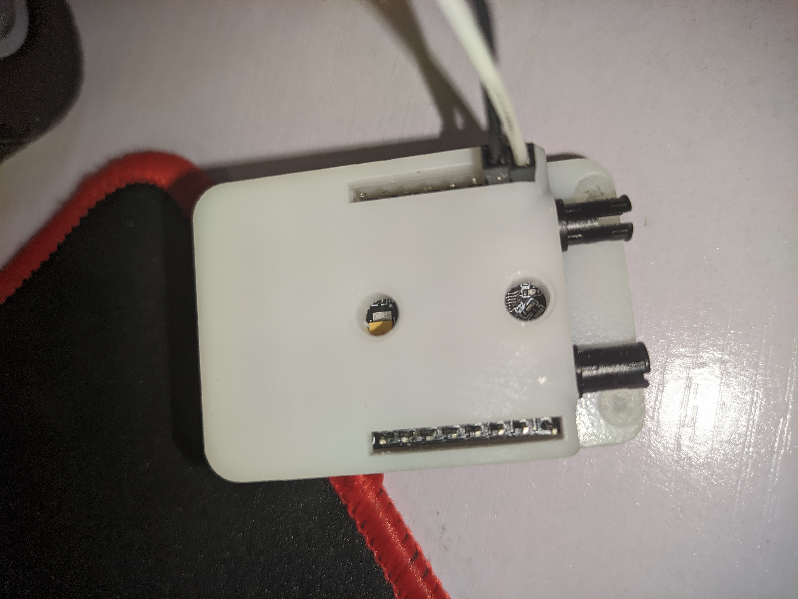

# smart-car-deep-learning

20级数科班 2022年暑期科研实训项目

## 功能

- 通过 HTTP 请求读取所有传感器/相机
- 自动化设备发现协议, 无需手动配置 IP 地址
- 通过 HTTP 请求控制电机/舵机/蜂鸣器/LED
- 使用游戏手柄遥控小车(游戏手柄连接到电脑, 运行 `client/joystick.py`)
- 人工智能自动驾驶

## 概述

- 作业相关文档在 `docs` 目录下。
- 固件在 `firmware` 目录下。
- PC 端软件在 `client` 目录下。
- 道路分割在 `roadseg` 目录下
- 交通标志识别在 `roadsign` 目录下

## 初始化

1. 克隆本仓库
2. 更新 Git 子模块: `git submodule update --init` (为了安装 PaddleSeg 和 PaddleDetection)
3. 从 Release 页面下载交通标志识别的权重文件 `model.pdiparams` 到 `signdet` 目录下

## 安装

### 运行环境

- 硬件： 开发板和 ESP32-CAM
- 软件： PC 端 Python 3.10+, 在 Windows/Linux 下测试过
- 热点: 使用电脑或手机开一个热点
  - 不要离小车太远, 不要使用家里的 WiFi (除非路由器就在小车旁边), 因为 ESP32 板载天线功率不是特别大, 距离远会导致网络延迟过高.
  - 若将开发板置于 AP 模式, 用电脑连接开发板的热点, 这会导致电脑无法连接到互联网(除非你有第二张无线网卡/连接有线网络), 因此不建议使用此模式
    - 如果确实需要使用此模式, 打开 `firmware/shared/lie-flat/src/config.h`, 修改 `AP_SSID` 和 `AP_PASSWORD`
    - 并且在下文的配置中把 `firmware/camera_web_server` 的 SSID 和密码 也一并修改为 `AP_SSID` 和 `AP_PASSWORD`
    - 修改 `firmware/web_ctrl/src/main.cpp`:
      ```diff
      // Be sure to define the WiFi mode before include lie-flat.h
      -#define LIE_FLAT_WIFI_STA
      +#define LIE_FLAT_WIFI_AP
      #include <lie-flat.h>
      ```
- 在树莓派上从源代码编译 PaddlePaddle. 注意我们采用的是 Manjaro ARM64 发行版，不能使用 arm32 架构的发行版。
  - Reference: https://qengineering.eu/install-paddlepaddle-on-raspberry-pi-4.html
  - 假设你有良好的国际网络连接
  - 因为我们的树莓派在该项目中仅用于单一用途，所以我们不建立虚拟环境，直接使用系统 pip 安装包
  - `sudo pacman -S base-devel` 安装基础开发工具
  - `sudo pacman -S protobuf patchelf swig unrar cmake cython python-opencv yay`
  - `yay -S gcc8 gcc8-fortran`
  - `sudo pip3 install --upgrade six requests wheel pyyaml numpy protobuf matplotlib nltk scipy`
  - 注意使用 gcc12 编译会出错，可以创建一个 mabma 环境来安装旧版 (v8.5) 的 `gcc` `g++` `gfortran`
  - `git clone https://github.com/Qengineering/Paddle --depth=1`
  - 注意设置内存交换文件，我使用的是 4GB 内存版本，系统默认设置了 5.5GB 的 zram, 所以我不用在进行特殊设置了。
    - ```bash
      [kxxt@pi ~]$ swapon
      NAME       TYPE      SIZE USED PRIO
      /dev/zram0 partition 5.5G   0B  100
      ```
  - 进入 Build 目录： `cd Paddle && mkdir build && cd build`
  - cmake： 注意替换你的 Python 版本：
    ```bash
    cmake .. -D PY_VERSION=3.10 \
          -D WITH_PYTHON=ON \
          -D WITH_CONTRIB=OFF \
          -D WITH_MKL=OFF \
          -D WITH_MKLDNN=OFF \
          -D WITH_XBYAK=OFF \
          -D WITH_TESTING=OFF \
          -D WITH_ARM=ON \
          -D ON_INFER=ON \
          -D CMAKE_BUILD_TYPE=Release
    ```
  - `make -j4`
  - 第一次编译失败后根据此处指示给代码打补丁(注意文件路径稍有不同)： https://github.com/facebookincubator/gloo/issues/332#issuecomment-1146812765
  - 然后再运行 `make -j4`

### 开发环境

- Visual Studio Code 
- Git v2+
- VSCode 的 PlatformIO 插件
- Arduino IDE v1.8~v2.0.0-rc9

### 配置

- 打开 `firmware/shared/lie-flat/src/config.h`, 修改 WiFi 的 SSID 和密码
- 按照 `firmware/shared/lie-flat/src/pin.h`，完成开发板接线。

###  接线

#### 摄像头



5V 和 GND 接开发板的 5V 和 GND

#### 舵机

舵机接开发板舵机B(注意不要接反)

#### 蜂鸣器

一根杜邦线连接开发板上的中间两个管脚

#### 电机

积木连接

#### 光电传感器/测速计/optocoupler

信号线接 GPIO14, VCC 和 GND 接开发板.

#### MPU6050 六自由度运动传感器

SCL/SDA 接开发板 SCL/SDA

VCC/GND 照旧

### 固件安装

- 使用 Arduino IDE 打开 `firmware/camera_web_server`，修改 WiFi 的 SSID 和密码，与配置步骤中的一样, 下载到 ESP32-CAM 上。
- 使用 VSCode + PlatformIO 打开 `firmware/main`, 构建并下载到开发板上。

## 启动

- PC 连接到同一热点
- 开启电源
- 运行 `client/main.py`, 该脚本会自动连接开发板，连接成功后，开发板蜂鸣器报警 1.5 秒。
- 在第一次启动之后, 脚本会生成设备缓存 `devices.cache.json`, 之后连接开发板蜂鸣器不再报警.
- 如果遇到连接问题(更换热点/IP变更),请删除 `devices.cache.json` 然后重新启动脚本.

